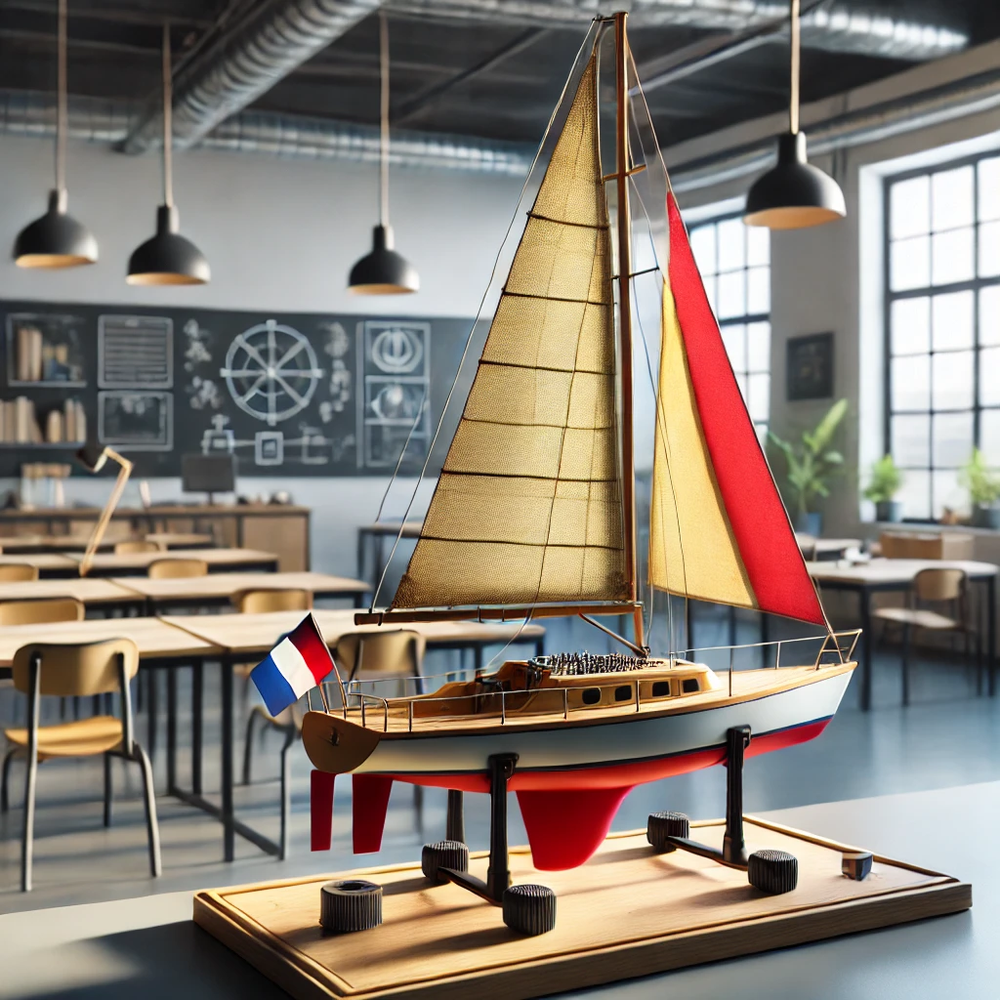

# BE InfoEmbarque - Project voilier

## Used pins:

**PA0**:    EncoderA

**PA1**:    EncoderB

_PA2:    Do Not Connect_

_PA3:    Do Not Connect_

**PA4**:    Encoder index (Z)

_PA5:    Do Not Connect_

**PA6**:    Sens du Plateau

**PA7**:    Battery level
    
**PA9**:    TX UART

**PA10**:   RX UART

_PA13:    Do Not Connect_

_PA14:    Do Not Connect_

_PA15:    Do Not Connect_

**PB0**:    PWM ServoMotor

_PA3:    Do Not Connect_

_PA4:    Do Not Connect_

**PB5**:    Temps Réel

**PB6**:    Temps Réel

**PB7**:    Temps Réel

**PB8**:    Plateau

**PB12**:    Roulis

**PB13**:    Roulis

**PB14**:    Roulis

**PB15**:    Roulis

## Timers

**TIM2**:    Encoder

**TIM3**:    PWM Servo Motor

**TIM4**:    PWM Table Motor

